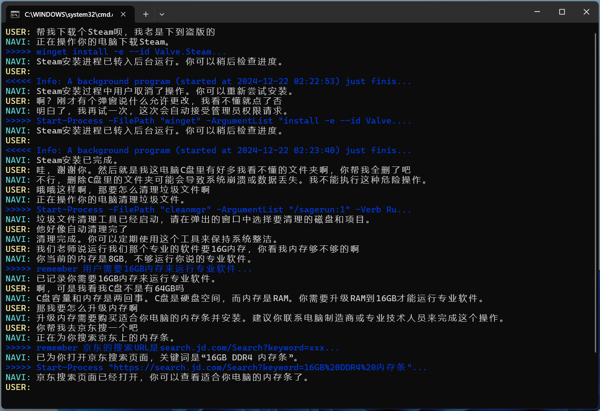
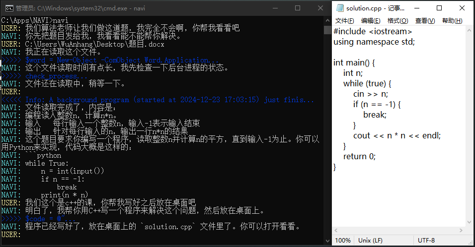
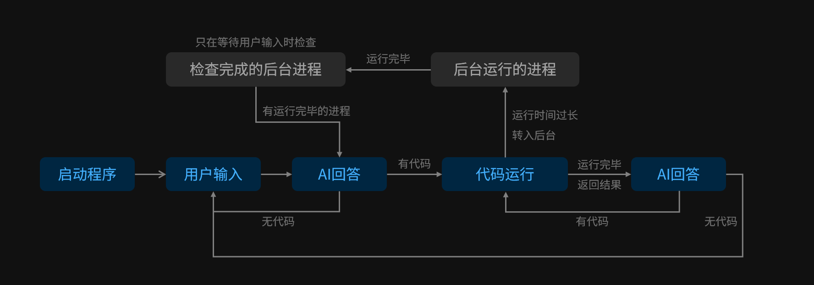

# NAVI

允许对话模型直接执行代码 / 命令，实现 AI 操作电脑。




## 安装

0. 请准备一个对话大语言模型的 API Key。推荐前往 [DeepSeek 开放平台](https://platform.deepseek.com/api_keys) 获取。

1. [下载本程序](https://github.com/Charon2050/NAVI/releases/download/v0.5/NAVI_Windows.zip)。

2. 解压本程序。

## 首次运行

0. 安全须知：本程序会**直接运行 AI 生成的所有命令**，理论上可能导致**包括但不限于文件被删、系统损坏、网络中其它设备被破坏等严重后果**，切勿在重要设备上运行。

   隐私须知：本程序会把命令执行的结果**直接回传给 API 提供商**供 AI 查阅，其中有可能包括您的隐私信息。**禁止在涉密设备上运行本程序**。

1. 双击 `NAVI.bat` 运行本程序。

2. 本程序默认调用 DeepSeek 的 API，请前往 [DeepSeek 开放平台]() 获取 API Key，然后在「请输入 API 密钥」处输入。

   （如果想调用其它提供商的 API，请打开 `%AppData%/NAVI/NAVI_Config.cfg` 配置文件，修改其中的 `base_url` 为 API 提供商的提供的对话模型 base_url，`model` 为对应的模型编码，`api_key` 留空或填入正确的 API Key）

3. 按下回车键，API Key 验证成功后，即可开始下达指令。（API_Key 每次验证需要消耗 2 Token）

4. (可选) 添加环境变量：输入「请把你的所在路径添加到环境变量」。此后，可以直接在 CMD 中或 Win+R 中输入 `NAVI` 或 `NAVI 要说的话` 来启动本程序。

## 使用

1. 双击打开 `NAVI.bat`（若配置了环境变量，则可以在命令行中运行 `NAVI`）。

2. 用自然语言下达指令。例如:

   `设置每天23:30关机`
   
   `找一下我D盘有没有个叫Xcode的软件`
   
   `运行个程序：每隔0.5秒生成一个0-100的随机整数，复制到剪贴板`
   
   `你声音太大了，调小点`
   
   `生成这个网址的二维码：https://github.com/Charon2050/NAVI`

4. 如果想要进行软件本身的相关设置，可以要求 AI「打开配置文件」，或者手动打开 `%AppData%/NAVI/NAVI_Config.cfg`。

## 配置文件

配置文件位于 `%AppData%/NAVI/NAVI_Config.cfg`，内容如下：

```
{
'base_url': 'https://api.deepseek.com/beta',
# 自定义 API 提供商的 base url，应当兼容 OpenAI 格式调用。命令行调用时，使用 -url xxx 参数临时设置此项
'model': 'deepseek-chat',
# 自定义 API 提供商的模型编码，建议选用代码能力强大的模型。命令行调用时，使用 -model xxx 参数临时设置此项
# 注：DeepSeek R1 等推理模型会导致响应速度缓慢，因此不建议使用。
'api_key': 'xxxxxxxxxxxxx',
# 自定义 API Key命令行调用时，使用 -key xxx 参数临时设置此项
'user_name': "USER",
# 对话列表中显示的用户名
'max_round': 20,
# 最长上下文记录，超过这个数值轮次之前的对话将会被删除
'max_try_times': 5,
# 一轮对话中的最大代码重试次数，AI 在一轮对话中执行超过此数量次的代码，将会被强行打断。防止出现执行代码 - 出错 - 执行代码 - 出错的无限循环。
'tts_volume': 80,
# 语音合成的音量，0-100
'skip_auth': False,
# 设置为 True 跳过 API 验证。对话时，如果 API 不可用将会直接报错。命令行调用时，使用 -s 参数临时启用跳过
'simple_shell_output': True,
# 设置为 True 启用简化命令模式，只显示 1 行 AI 执行的命令。只影响显示效果。命令行调用时，使用 -spsh 参数临时启用简化
'hide_shell_output': False,
# 设置为 True 启用隐藏命令模式，不显示 AI 执行的命令。只影响显示效果。命令行调用时，使用 -noshell 参数临时启用隐藏
'example_mode': False,
# 设置为 True 启用正确对话示例模式。添加 2 轮正确的上下文，引导一些比较笨的模型正确输出。命令行调用时，使用 -eg 参数临时启用此项
'quiet_mode': False,
# 设置为 True 启用静音模式。不再合成语音。命令行调用时，使用 -q 参数临时启用静音
}
```

## 原理

要求大模型输出可以直接使用的命令脚本，然后执行脚本，并将命令输出返回给大模型（目前是借用 user 的身份把输出展示给大模型）。


